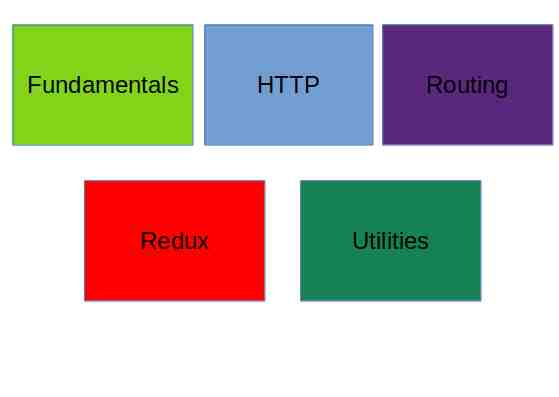

# React

*A repository for ReactJs learning enthusiast.*

    React is a Javascript library for building user-interfaces

*Key points:-*

- Not a frameworks
- Focus on UI
- Dosen't focus on routing

## Why Learn React?

- React is a project created and maintained by Facebook.
- More than 100k starts on Github
- Huge community
- In demand skillset

- **Component Based Architecture**

    A traditional website can be broken down into components like: header, footer etc.
- Reusable code
- React is declarative.

    Tell React what you want and React will build the actual UI. 

    React will handle efficiently updating and rendering of the components 

    DOM updates are handles gracefully in React.
- Seamlessly integrate react into any of applications.
- Portion of your page or a complete application can be developed using React.
- React native is avaiable for mobile applications.

## **Pre-requisites before React: -**

- HTML,CSS and JavaScript fundamentals.
- ES6(ECMA Script 6)
- JavaScript - 'this' keyword, filter, map and reduce.
- ES6- let & const, arrow functions, template literals, default parameters, Object literals, rest and spread operators and destrcturing assignment.

<figure>

<figcaption>React Road map</figcaption>

</figure>

## Pre-requisite for React: -

- Node Js
- IDE(text editor)

 <em><i>Made with love - Deepak Suryawanshi</i></em>
